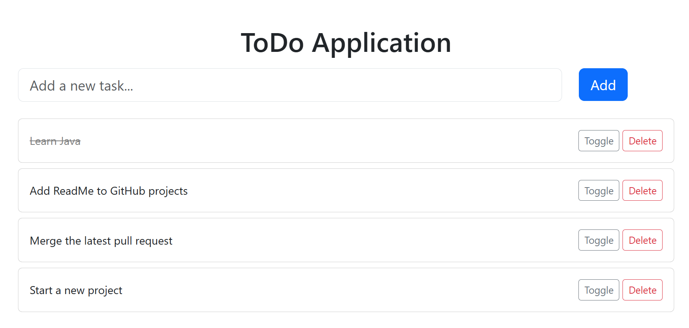

# Spring Boot To-Do Application ✅

This is a simple **ToDo App** built with:
- Spring Boot
- Thymeleaf
- MySQL
- Bootstrap

### Features
- Add, update, delete tasks
- Mark tasks as complete
- View all tasks

### Setup Instructions
1. Clone this repository  
2. Update `application.properties` with your DB details  
3. Run the application with `mvn spring-boot:run`  
4. Access at `http://localhost:8080/`

### Future Improvements
- User authentication
- Deploy on cloud
- REST API endpoints

### ToDo Application 

